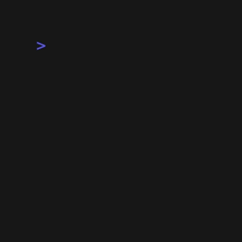

# commit-check-mcp

[](https://pypi.org/project/commit-check-mcp/)
[](https://pypi.org/project/commit-check-mcp/)
[](https://github.com/commit-check/commit-check-mcp/actions/workflows/main.yml)
[](https://codecov.io/gh/commit-check/commit-check-mcp)
[](https://modelcontextprotocol.io/)
[](https://smithery.ai)

> **AI agent-friendly commit validation via MCP.** Built for AI coding agents (Claude Code, Cursor, Copilot, etc.) — not just human CI pipelines.



**commit-check-mcp** is a [Model Context Protocol (MCP)](https://modelcontextprotocol.io/) server that exposes [commit-check](https://github.com/commit-check/commit-check) validations as structured tools. AI agents call these tools to validate commit messages, branch names, author info, push safety, and repository state — every tool returns pass/fail results with actionable suggestions.

### Why this vs commitlint?

| | commitlint | commit-check-mcp |
|---|---|---|
| **Target user** | Humans in CI pipelines | AI coding agents via MCP |
| **Interface** | CLI + git hooks + config files | MCP tools (JSON in/out) |
| **Output** | Terminal text, exit codes | Structured JSON with `.error` + `.suggest` fields |
| **Agent awareness** | None | AGENTS.md instructions, tool descriptions optimized for LLM function calling |
| **Integration** | husky + CI config | Drop-in MCP server config for any MCP client |
| **Repository context** | Reads config from cwd | Explicit `repo_path` + `config_path` params — works across repos |

## For AI Agents

If you're an AI coding agent working in this repository, read **[AGENTS.md](AGENTS.md)** for instructions on how to use commit-check-mcp tools effectively.

Key conventions for agents:
- Always validate commit messages **before** writing them
- Read `.suggest` on failures — it contains the exact fix
- Call `describe_validation_rules` when entering a new repo
- Use `validate_repository_state` for comprehensive checks in one call

## Features

This MCP server exposes commit-check validations as MCP tools:

- `server_health` — returns server/sdk versions
- `validate_commit_message` — validates a commit message
- `validate_branch_name` — validates a branch name or the current repo branch
- `validate_push_safety` — validates that a push is not a force push
- `validate_author_info` — validates author name/email or the repo's git author config
- `validate_commit_context` — runs combined checks in one call
- `validate_repository_state` — validates latest commit, current branch, author state, and optional push safety for a repo
- `describe_validation_rules` — returns the effective config and enabled rules after merging defaults and repo config

All validation tools return the same structured commit-check result shape:

```json
{
  "status": "pass|fail",
  "checks": [
    {
      "check": "message",
      "status": "pass|fail",
      "value": "...",
      "error": "...",
      "suggest": "..."
    }
  ]
}
```

## Installation

```bash
pip install commit-check-mcp
```

This installs the `commit-check-mcp` CLI entrypoint.

For local development from this repository:

```bash
pip install -e .
```

## Use With An MCP Client

This server runs over stdio, so it is meant to be launched by an MCP client rather than used as a long-running HTTP service.

Generic MCP client config:

```json
{
  "mcpServers": {
    "commit-check": {
      "command": "commit-check-mcp"
    }
  }
}
```

If the client needs the full path to the executable, first locate it:

```bash
which commit-check-mcp
```

Then use that absolute path in the client config.

Example using an absolute path:

```json
{
  "mcpServers": {
    "commit-check": {
      "command": "/absolute/path/to/commit-check-mcp"
    }
  }
}
```

For local development from this repository, that absolute path may point to something like `.venv/bin/commit-check-mcp`.

## Smithery / mcp.so

commit-check-mcp is available on [Smithery](https://smithery.ai), the MCP server registry:

```bash
npx @smithery-ai/cli install commit-check-mcp
```

Or add it to your MCP client directly using the [Smithery config](smithery.yaml).

## Run Manually

```bash
commit-check-mcp
```

The server uses stdio transport, which is the recommended MCP default for local tool integrations.

## Tool Usage

After the client starts the server, it will expose these tools:

- `server_health`: returns server, SDK, and dependency versions
- `validate_commit_message(message, config?, repo_path?, config_path?)`
- `validate_branch_name(branch?, config?, repo_path?, config_path?)`
- `validate_push_safety(push_refs?, config?, repo_path?, config_path?)`
- `validate_author_info(author_name?, author_email?, config?, repo_path?, config_path?)`
- `validate_commit_context(message?, branch?, author_name?, author_email?, config?, repo_path?, config_path?)`
- `validate_repository_state(repo_path?, config?, config_path?, include_message?, include_branch?, include_author?, include_push?)`
- `describe_validation_rules(config?, repo_path?, config_path?)`

The common optional arguments are:

- `repo_path`: repository directory to validate against
- `config_path`: explicit TOML config file; relative paths resolve from `repo_path`
- `config`: ad-hoc config overrides merged on top of defaults and repo config

## Common Examples

Validate a commit message using repo-local rules:

```json
{
  "message": "feat(api): add MCP validation tool",
  "repo_path": "/path/to/repo"
}
```

Validate the current repository branch using an explicit config file:

```json
{
  "repo_path": "/path/to/repo",
  "config_path": ".github/commit-check.toml"
}
```

Validate the full repository state:

```json
{
  "repo_path": "/path/to/repo",
  "include_message": true,
  "include_branch": true,
  "include_author": true
}
```

Validate push safety from git pre-push hook ref metadata:

```json
{
  "repo_path": "/path/to/repo",
  "push_refs": "refs/heads/main abc123 refs/heads/main def456"
}
```

Inspect the final merged rules that will be applied:

```json
{
  "repo_path": "/path/to/repo",
  "config": {
    "commit": {
      "require_body": true
    }
  }
}
```

## Repository-Aware Validation

`commit-check` is most useful when it runs against a real git repository and its `cchk.toml` or `commit-check.toml` file. This MCP server now supports that directly:

- `repo_path` — run git-based validations against a specific repository
- `config_path` — point to an explicit TOML config file; relative paths are resolved from `repo_path`
- `config` — apply ad-hoc overrides on top of defaults and repo config

Typical patterns:

- Validate an explicit message with a repository's rules
- Validate the current repository state without passing message/branch/author values manually
- Validate push safety using pre-push ref metadata, or check the current branch against its upstream
- Inspect which rules are actually enabled after config merging

Example payload for a repository-wide validation:

```json
{
  "repo_path": "/path/to/repo",
  "include_message": true,
  "include_branch": true,
  "include_author": true,
  "include_push": true
}
```

Config precedence is:

1. `commit-check` built-in defaults
2. repository config loaded from `repo_path`
3. `config_path` when explicitly provided
4. inline `config` overrides passed to the tool

## Development

### Running tests

```bash
pip install -e .[dev]
pytest -q --cov=src/commit_check_mcp
```

### Regenerating the demo GIF

Requires [vhs](https://github.com/charmbracelet/vhs):

```bash
brew install vhs
vhs demo/demo.tape --output demo/demo.gif
```

Edit `demo/demo-compact.py` to change the demo content.

## License

MIT — see [LICENSE](LICENSE).
